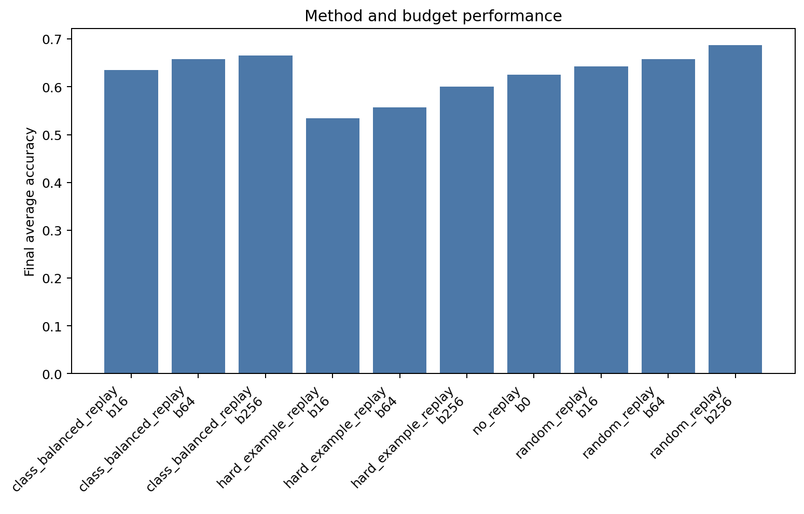
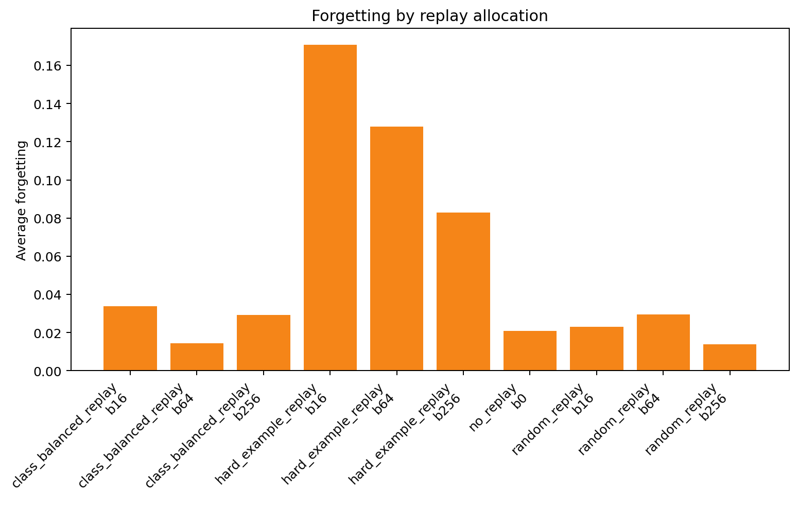
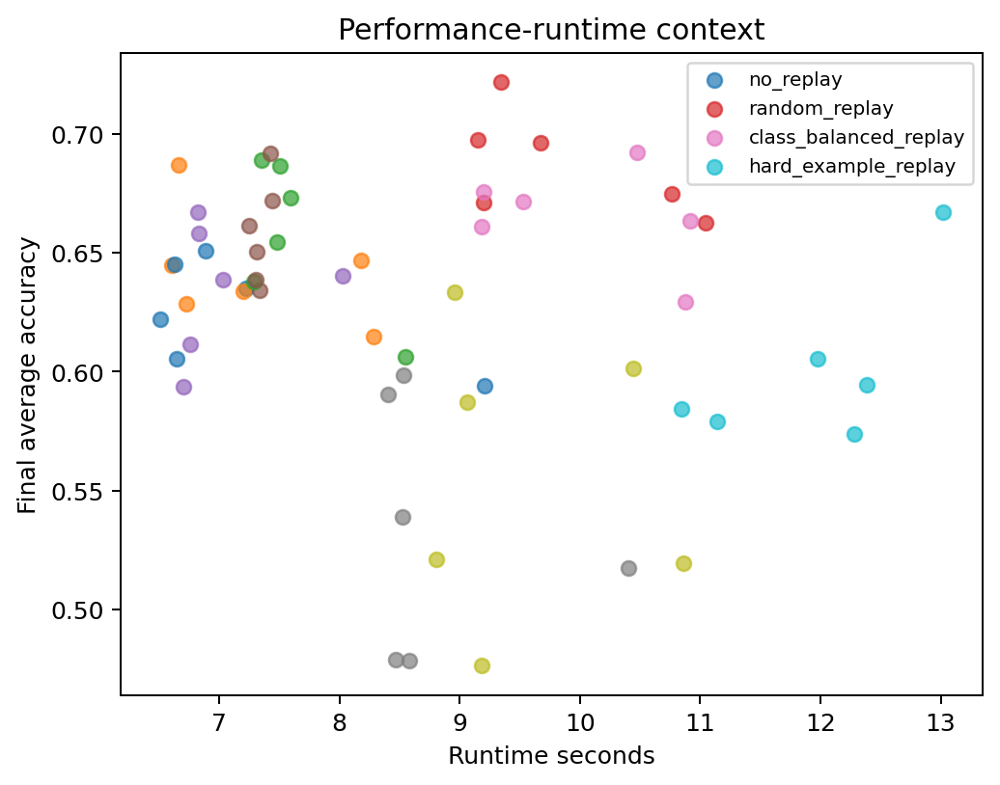

# Replay Allocation Strategies for Adapter-Based Continual Text Classification

> **Replay Allocation Strategies for Adapter-Based Continual Text Classification under Limited Memory**  
> Yaowen Sun, Shaolei Zhao, Yi Yang

## Overview

This package contains analysis-level data, figures, and verification code for a
controlled study of replay allocation in adapter-based continual text
classification. The evaluated conditions are no replay, random replay,
class-balanced replay, and hard-example replay under three replay budgets.

The package is designed for reproducibility from cleaned CSV/JSON summaries. It
does not include raw execution folders, model checkpoints, caches, datasets, or
private process records.

## Repository Structure

```text
.
├── README.md
├── LICENSE
├── requirements.txt
├── environment.json
├── src/
│   ├── aggregate_pilot.py
│   ├── analyze_full_matrix.py
│   ├── continual_runner.py
│   ├── metrics.py
│   ├── paper_tasks.py
│   ├── replay_buffer.py
│   ├── run_full_matrix.py
│   ├── run_pilot.py
│   └── verify_public_data.py
├── data/
│   ├── results.csv
│   ├── results_aggregated.csv
│   ├── statistics.json
│   ├── summary.json
│   └── table_pairwise.tex
└── figures/
    ├── figure_method_budget_accuracy.png
    ├── figure_forgetting_by_method_budget.png
    └── figure_accuracy_runtime.png
```

## Experimental Setup

| Dimension | Levels |
|---|---|
| Backbone | DistilBERT base uncased |
| Adaptation | LoRA on query and value projections |
| Tasks | SST-2, MRPC, RTE, AG News |
| Task orders | O1: SST-2, MRPC, RTE, AG News; O2: AG News, RTE, MRPC, SST-2 |
| Replay methods | no_replay, random_replay, class_balanced_replay, hard_example_replay |
| Replay budgets | 0, 16, 64, and 256 examples per previous task |
| Seeds | 113, 227, 349 |
| Training cap | 512 training examples per task |
| Evaluation cap | 512 evaluation examples per task |
| Row-level data | 60 completed condition rows |
| Aggregated data | 10 method-budget summary rows |

The row-level table records final average accuracy, average forgetting,
wall-clock seconds, memory fields, final task scores, order, seed, method, and
budget. The public table omits local result paths while retaining the fields
needed to recompute the reported replay comparisons.

## Hardware & Environment

| Component | Specification |
|---|---|
| CPU | Intel Core i9-12900K (16C/24T) |
| RAM | 128 GB DDR5 |
| GPU | NVIDIA RTX PRO 6000 Blackwell Workstation Edition (95.59 GiB VRAM reported) |
| OS | Ubuntu 22.04 (WSL2) |

### Software Versions

| Package | Version |
|---|---|
| Python | 3.11.15 |
| PyTorch | 2.11.0+cu128 |
| CUDA | 12.8 |
| Transformers | 5.4.0 |
| PEFT | 0.18.1 |
| Datasets | 4.8.4 |
| evaluate | 0.4.6 |
| sentencepiece | 0.2.1 |
| NumPy | 2.4.4 |
| pandas | 3.0.1 |
| SciPy | 1.17.1 |
| scikit-learn | 1.8.0 |

## Key Results

- The full data table contains 60 completed condition rows with zero failed cells.
- Each replay method-budget cell contains six matched runs: two task orders by three seeds.
- Random replay with budget 256 has the highest mean final average accuracy, 0.6873, and the lowest mean average forgetting, 0.0139.
- The matched descriptive final-accuracy delta for random replay at budget 256 versus no replay is 0.0620.
- Holm-corrected pairwise tests do not cross conventional significance thresholds; the results should be read as bounded empirical trends.
- Class-balanced replay at budget 64 provides a moderate-budget tradeoff, while the tested hard-example replay rule underperforms simpler allocation strategies in this controlled setup.







## Requirements

Install the optional analysis dependencies:

```bash
python -m pip install -r requirements.txt
```

The quick verification script only uses the Python standard library.

Run:

```bash
python src/verify_public_data.py
```

Expected output:

```text
PASS: public data checks completed
```

## Citation

```bibtex
@article{sun2026continual_replay_adapters,
  title={Replay Allocation Strategies for Adapter-Based Continual Text Classification under Limited Memory},
  author={Sun, Yaowen and Zhao, Shaolei and Yang, Yi},
  year={2026}
}
```
