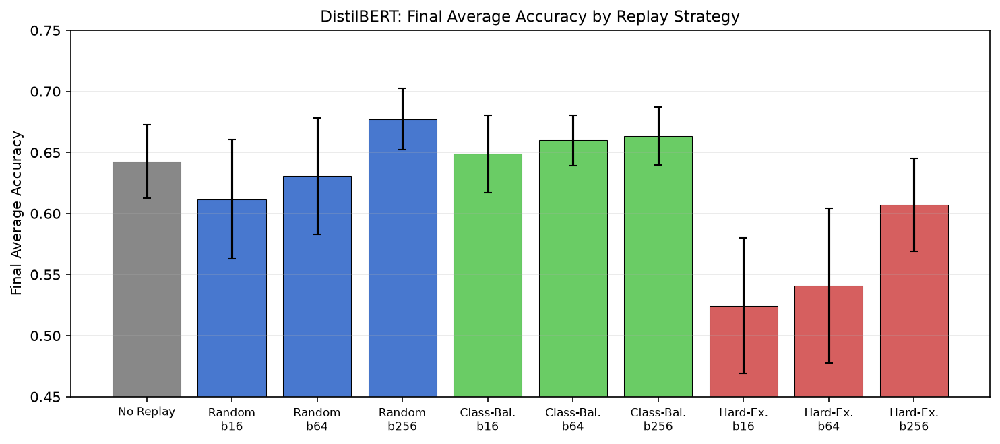
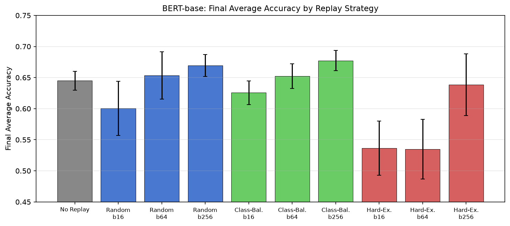
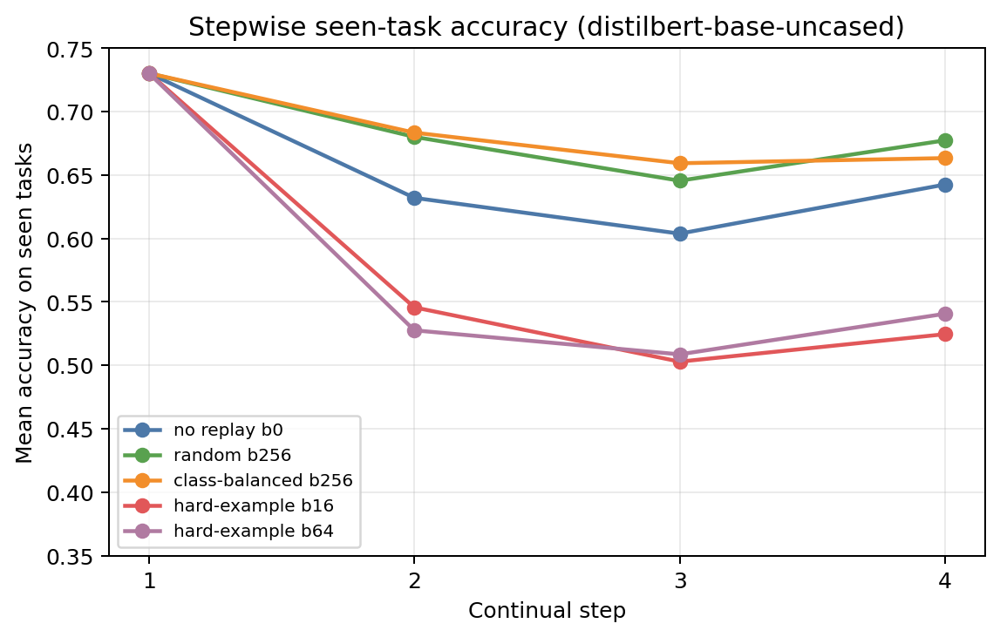
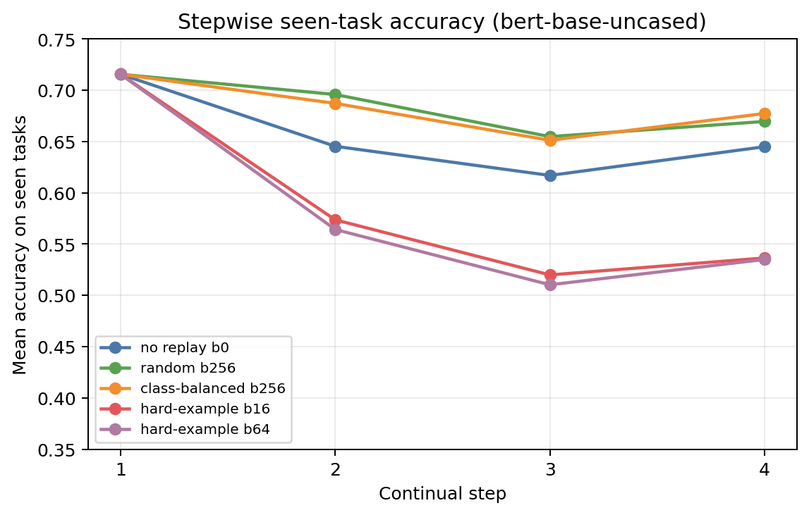
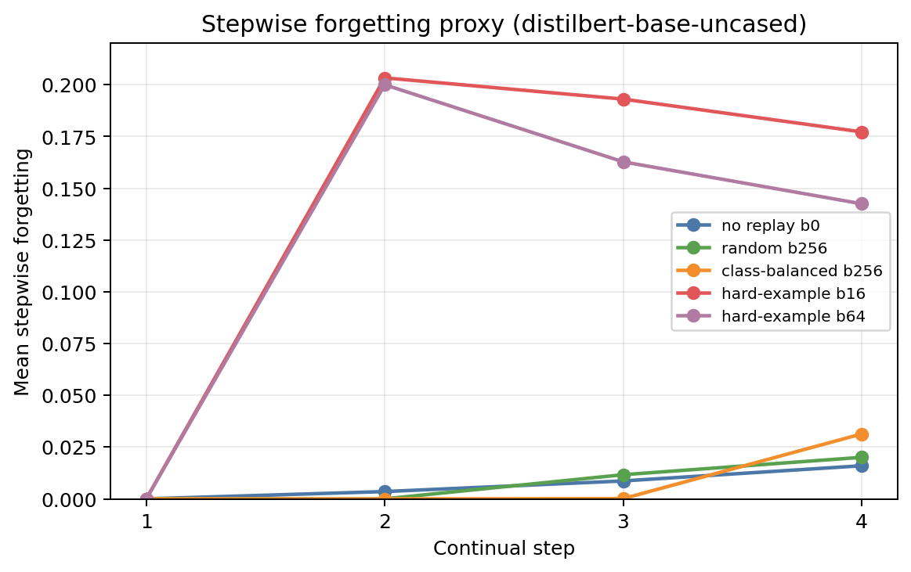
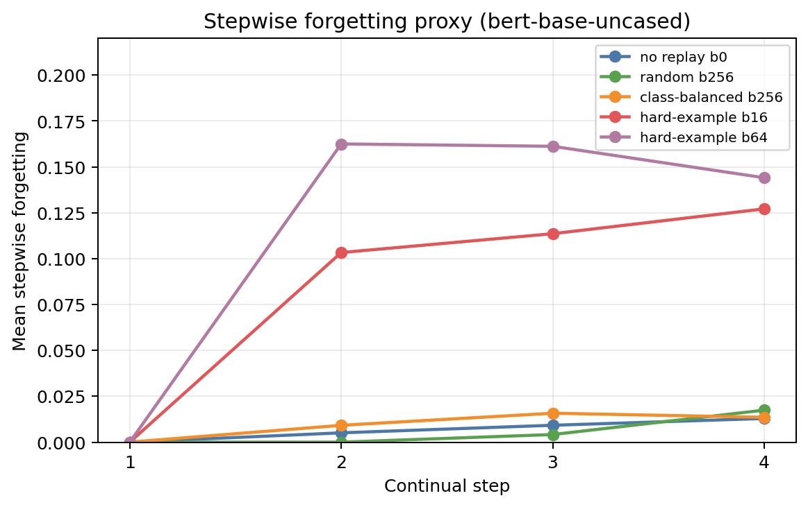

# Replay Allocation Strategies for Adapter-Based Continual Text Classification

> **Replay Allocation Strategies for Adapter-Based Continual Text Classification under Limited Memory**  
> Yaowen Sun, Shaolei Zhao, Yi Yang

## Overview

This package contains analysis-level data, figures, and verification code for a controlled study of replay allocation in adapter-based continual text classification. The evaluated allocation strategies are no replay, random replay, class-balanced replay, and hard-example replay.

The experiment covers two encoder backbones, four text classification tasks, two task orders, five seeds, and ten method-budget settings per backbone. The full matrix contains 200 completed runs with zero failed cells. The package is designed for reproducibility from cleaned CSV/JSON summaries and does not include raw execution folders, model checkpoints, model caches, datasets, or private process records.

## Repository Structure

```text
.
├── README.md
├── LICENSE
├── requirements.txt
├── environment.json
├── src/
│   ├── aggregate_pilot.py
│   ├── analyze_full_matrix.py
│   ├── continual_runner.py
│   ├── metrics.py
│   ├── paper_tasks.py
│   ├── replay_buffer.py
│   ├── run_full_matrix.py
│   ├── run_pilot.py
│   └── verify_public_data.py
├── data/
│   ├── aggregate_results.csv
│   ├── full_matrix_cells.csv
│   ├── distilbert_results_aggregated.csv
│   ├── bertbase_results_aggregated.csv
│   ├── distilbert_statistics.json
│   ├── bertbase_statistics.json
│   ├── distilbert_matrix_plan.json
│   ├── bertbase_matrix_plan.json
│   └── summary.json
└── figures/
    ├── figure_method_budget_accuracy_distilbert.png
    ├── figure_method_budget_accuracy_bertbase.png
    ├── figure_stepwise_seen_accuracy_distilbert.png
    ├── figure_stepwise_seen_accuracy_bertbase.png
    ├── figure_stepwise_forgetting_distilbert.png
    └── figure_stepwise_forgetting_bertbase.png
```

## Experimental Setup

| Dimension | Levels |
|---|---|
| Backbones | DistilBERT base uncased; BERT base uncased |
| Adaptation | Adapter-based classification heads with fixed training recipe |
| Tasks | SST-2, MRPC, RTE, AG News |
| Task orders | O1: SST-2, MRPC, RTE, AG News; O2: AG News, RTE, MRPC, SST-2 |
| Replay methods | no_replay, random_replay, class_balanced_replay, hard_example_replay |
| Replay budgets | 0 for no replay; 16, 64, and 256 examples per previous task otherwise |
| Seeds | 113, 227, 349, 461, 587 |
| Training cap | 512 training examples per task |
| Evaluation cap | 512 evaluation examples per task |
| Epochs | 1 |
| Batch size | 8 |
| Learning rate | 2e-4 |
| Maximum length | 128 tokens |
| Cell summary data | 200 completed run cells |
| Aggregated data | 20 backbone x method-budget summary rows |

The row-level cell summary records backbone, task order, seed, method, budget, pass status, runtime, and task sequence. The aggregate table records mean final average accuracy, average forgetting, and runtime summaries for each backbone and method-budget setting.

## Hardware & Environment

| Component | Specification |
|---|---|
| CPU | Intel Core i9-12900K (16C/24T) |
| RAM | 128 GB DDR5 |
| GPU | NVIDIA RTX PRO 6000 Blackwell Workstation Edition (95.59 GiB VRAM reported) |
| OS | Ubuntu 22.04 (WSL2) |

### Software Versions

| Package | Version |
|---|---|
| Python | 3.11.15 |
| PyTorch | 2.11.0+cu128 |
| CUDA | 12.8 |
| Transformers | 5.4.0 |
| PEFT | 0.18.1 |
| Datasets | 4.8.4 |
| evaluate | 0.4.6 |
| sentencepiece | 0.2.1 |
| NumPy | 2.4.4 |
| pandas | 3.0.1 |
| SciPy | 1.17.1 |
| scikit-learn | 1.8.0 |

## Key Results

- The full matrix contains 200 completed runs: 100 runs for DistilBERT and 100 runs for BERT-base, with zero failed cells.
- At budget 256, both backbones show positive descriptive final-accuracy trends. DistilBERT reaches its best mean final average accuracy under random replay, while BERT-base reaches its best mean final average accuracy under class-balanced replay.
- The positive random-replay accuracy deltas versus no replay do not survive standard Holm correction.
- The main corrected finding is contrastive: low-budget hard-example replay underperforms no replay for accuracy on both backbones, with additional corrected forgetting penalties.
- Stepwise curves provide descriptive context and should not be interpreted as independent significance tests.













## Requirements

Install the optional analysis dependencies:

```bash
python -m pip install -r requirements.txt
```

The quick verification script only uses the Python standard library.

Run:

```bash
python src/verify_public_data.py
```

Expected output:

```text
PASS: public data checks completed
```

## Citation

```bibtex
@article{sun2026replay_allocation,
  title={Replay Allocation Strategies for Adapter-Based Continual Text Classification under Limited Memory},
  author={Sun, Yaowen and Zhao, Shaolei and Yang, Yi},
  year={2026}
}
```
